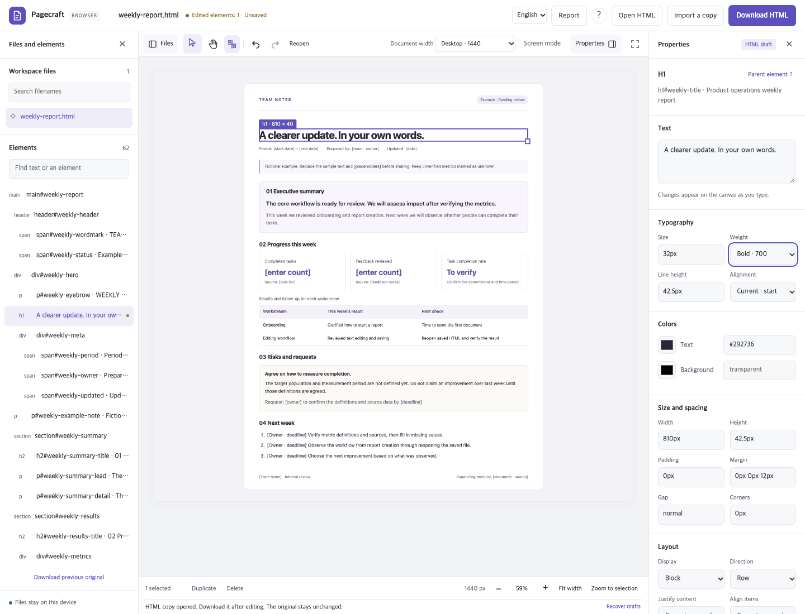
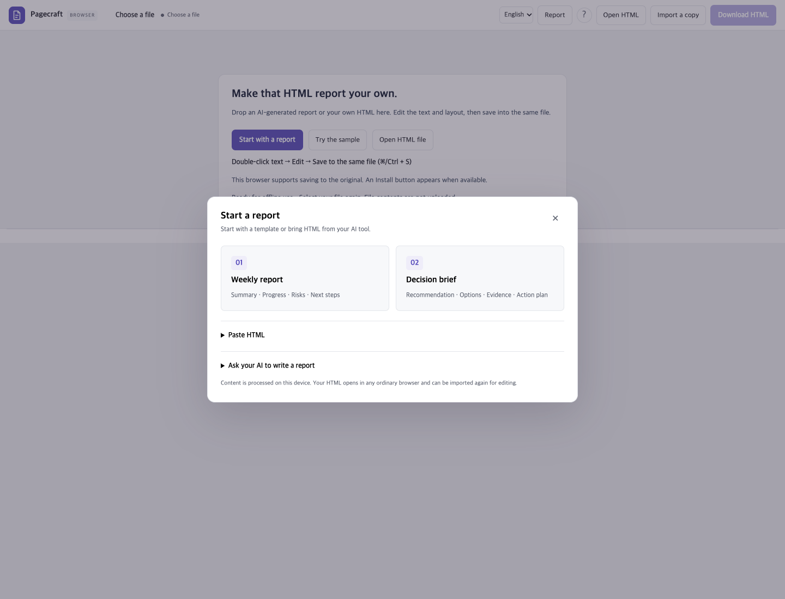
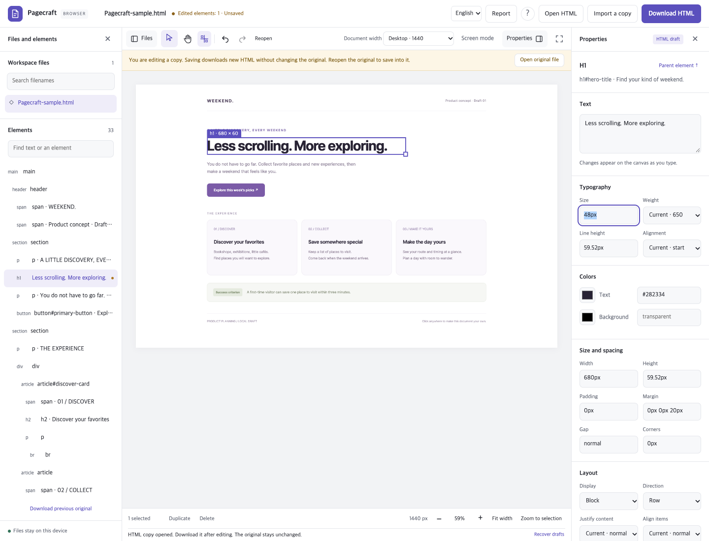

# Pagecraft

**Your AI made the HTML. Make it yours.**

Open a report, landing page, or static mockup. Fix a headline, adjust the layout, and save ordinary HTML—without rebuilding the page or asking an AI to regenerate it.

Pagecraft is a local-first visual HTML editor with an **English interface**, a **Korean language switch**, and a **file-based CLI for coding agents**. No account, API key, or AI subscription is needed to edit a document.



[**Try Pagecraft in your browser →**](https://suwonleee.github.io/pagecraft/)

[Run locally](#get-started) · [What you can make](#what-you-can-make) · [Human–AI workflow](#work-on-the-same-file-with-a-coding-agent) · [Usage guide](docs/USAGE.md)

## What you can make

### Turn an AI draft into a report you can send

Start with a **Weekly report** or **Decision brief**, or paste complete HTML from your AI tool. Double-click a sentence to rewrite it, select an element to adjust its style, and download the result. The built-in reports include meaningful element IDs, responsive layouts, and A4 print rules.



1. Choose **Report → Weekly report**.
2. Select the title and change it in **Text**, or double-click it on the canvas.
3. Adjust **Typography**, **Colors**, or **Size and spacing**.
4. Choose **Download HTML**, then reopen the file to check the result.

The templates are explicitly fictional examples. Replace placeholders with your own facts before sharing. Pagecraft does not invent metrics or call an AI service.

### Polish a landing page without a build pipeline

Try the bundled product concept, replace the headline and call to action, and preview desktop, tablet, or mobile widths. You can move, resize, duplicate, delete, and align elements; undo restores the previous state.



Choose **Try the sample** to follow this example. Your saved file stays HTML: open it in a browser, put it in a Git repository, or publish it with your own static host.

### Work on the same file with a coding agent

Use the canvas for visual decisions and the CLI for precise, repeatable edits. Claude Code, Codex, or another coding agent can inspect a saved HTML file and apply a source patch without a running editor server or provider SDK.

```sh
# In the Pagecraft checkout, with dependencies installed:
npm run --silent document -- inspect ./report.html --query weekly-summary-lead
```

Ask your coding agent:

> Read `docs/AI_EDITING.md`. Inspect `report.html`, shorten the executive summary, and preserve every other section, style, ID, and print rule. Validate the patch before writing it. Do not regenerate the document.

The agent uses the returned hash and exact target in a JSON patch:

```json
{
  "version": 1,
  "hash": "REPLACE_WITH_THE_HASH_FROM_INSPECT",
  "changes": [
    {
      "target": "weekly-summary-lead",
      "text": "The core workflow is ready for review. Impact is still being measured."
    }
  ]
}
```

```sh
npm run --silent document -- apply ./report.html --patch edits.json --dry-run
npm run --silent document -- apply ./report.html --patch edits.json --write
```

**Save visual edits before handing off. Reload after the agent writes.** Stale hashes are rejected, and `--write` backs up the previous file. This is sequential collaboration with conflict detection, not live merging. [Complete agent workflow](docs/AI_EDITING.md)

## Get started

Open [the browser app](https://suwonleee.github.io/pagecraft/) to try a sample without installing anything. To run it yourself, follow the steps below.

Requires **Node.js 22.12+** and npm for a local build; `.nvmrc` selects Node.js 24.

```sh
git clone https://github.com/suwonleee/pagecraft.git
cd pagecraft
npm ci
npm run build:web
npm run serve:web
```

Open **http://127.0.0.1:4318/**. Choose **Start with a report**, **Try the sample**, or bring your own HTML.

The app starts in English. Use the language menu to switch to **한국어**. Your preference stays in this browser; changing the editor language never translates your document. A language change reloads the editor, so save first or cancel the unsaved-edit prompt.

### Pick the right mode

| Mode | Use it for | How saving works |
|---|---|---|
| Browser app | A self-contained HTML file | **Open HTML** can save into an authorized original in supported browsers; imported copies are downloaded |
| Local folder server | HTML with nearby CSS, images, and fonts | Writes inside the selected project folder, with backups and conflict checks |
| Installed web app | Opening the editor from an app icon | Same file permissions as the browser app; supported installed apps can receive HTML through **Open with** |
| Optional extension | Opening the bundled editor from Chrome’s toolbar | Same browser-file workflow; does not capture or modify the current website |
| Document CLI | Agent edits and automation | Hash-checked patches to saved files; `--write` updates the original, `--output` creates a separate copy |

To edit a project folder:

```sh
npm start -- ./drafts
# Or open one file on a different port:
npm start -- ./report.html --port 4319
```

Folder mode normally opens **http://127.0.0.1:4317**. Keep the server running. With no path, `npm start` creates a `.pagecraft/` workspace containing `getting-started.html`.

### Saving is explicit

- **Open HTML:** in Chromium-based browsers on HTTPS or localhost, grant permission to save back to the original.
- **Import a copy / Paste HTML / templates:** edit in the browser and **Download HTML**. Downloading does not overwrite the original or clear its unsaved state.
- **Recover drafts:** temporary browser storage can reopen unsaved work as a separate copy. It is not a replacement for saving a file.

Browser mode accepts one UTF-8 HTML file up to **16 MiB**. It cannot read sibling assets automatically; embed them or use folder mode. [Saving, recovery, and browser differences](docs/USAGE.md)

### Build an optional extension or a static deployment

```sh
npm run build:extension
```

In Chrome, open `chrome://extensions`, enable **Developer mode**, choose **Load unpacked**, and select `extension-dist/`. Click the Pagecraft icon to open its editor. It requests no host permissions and injects no content scripts. There is no extension-store listing.

`npm run build:web` produces `web-dist/` for a static host. Serve it over HTTP(S), with a trailing slash for a subdirectory URL. **Opening `index.html` through `file://` is not supported** because browsers block its modules and worker. Tagged releases can publish prebuilt web and extension ZIPs; check [Releases](https://github.com/suwonleee/pagecraft/releases) for availability.

## Controls at a glance

| Task | Control |
|---|---|
| Edit text | Double-click, or use **Text** in the properties panel |
| Select multiple elements | Shift-click or drag a selection on empty canvas |
| Move with snapping | Drag; hold Alt/Option to move freely |
| Duplicate / delete | `⌘/Ctrl+D` / `Delete` |
| Undo / redo | `⌘/Ctrl+Z` / `⌘/Ctrl+Shift+Z` |
| Pan / zoom | Space-drag / `⌘/Ctrl+scroll` |
| Save or download | `⌘/Ctrl+S` or `⌘/Ctrl+Enter` |
| More canvas space | **Focus canvas** folds both side panels |

## What stays yours

- **Ordinary HTML, not a project format.** Saves patch source ranges instead of reserializing the whole document.
- **Files stay local.** Browser mode processes documents on your device. Folder mode runs on the loopback address.
- **One editing engine.** Browser, folder server, and CLI share source-preserving edit operations.
- **No frontend framework or CDN fonts.** Native modules, on-demand worker loading, and a virtualized element list keep the editor small.

Pagecraft edits static `.html` and `.htm` files. Scripts and external resources are blocked in previews, and some pages may render differently. SVG/canvas drawings remain in the source but cannot be edited as individual HTML elements. PPTX, Figma, draw.io, element reparenting/reordering, and live collaboration are not supported. [Architecture and limits](docs/ARCHITECTURE.md)

## Development

```sh
npm run check           # Typecheck, browser syntax, unit and API tests
npm run test:e2e        # Folder editor and human–AI handoff
npm run test:browser    # Static app in Chromium, Firefox, and WebKit
npm run test:extension  # Unpacked extension in Chromium
npm run build          # Server and CLI build
```

Install browser test engines with `npx playwright install chromium firefox webkit`; the local Chromium suites use installed Chrome by default. Browser and extension builds share output, so run them sequentially.

The README screenshots are captured from real UI interactions in [the English browser journey](e2e/english-ui.spec.ts). [Reproduce the screenshots](docs/SCREENSHOTS.md) · [Contributing and commit style](CONTRIBUTING.md) · [Tests and builds](docs/ARCHITECTURE.md#tests-and-builds)

[MIT licensed](LICENSE). No account required. No document upload service. Your HTML remains yours.
