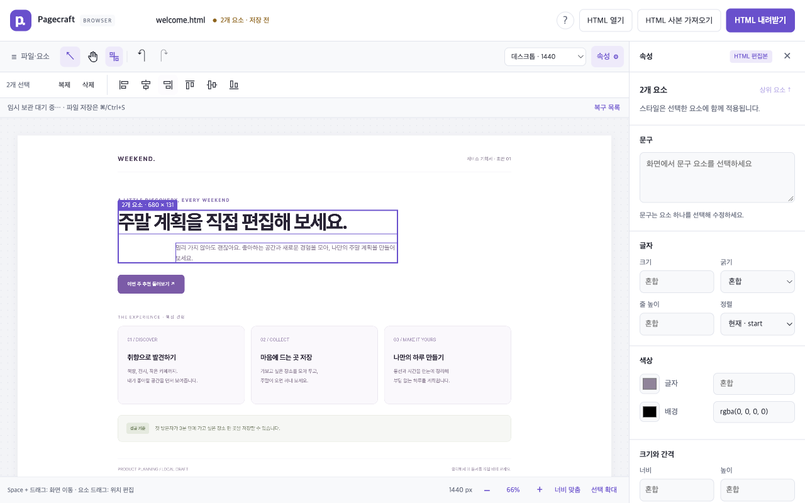
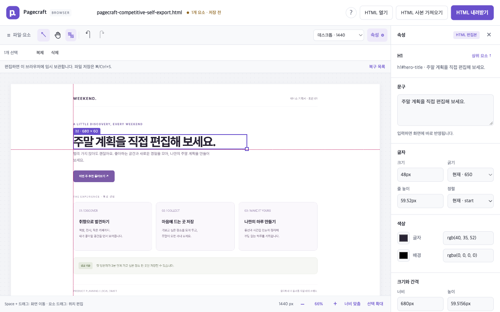
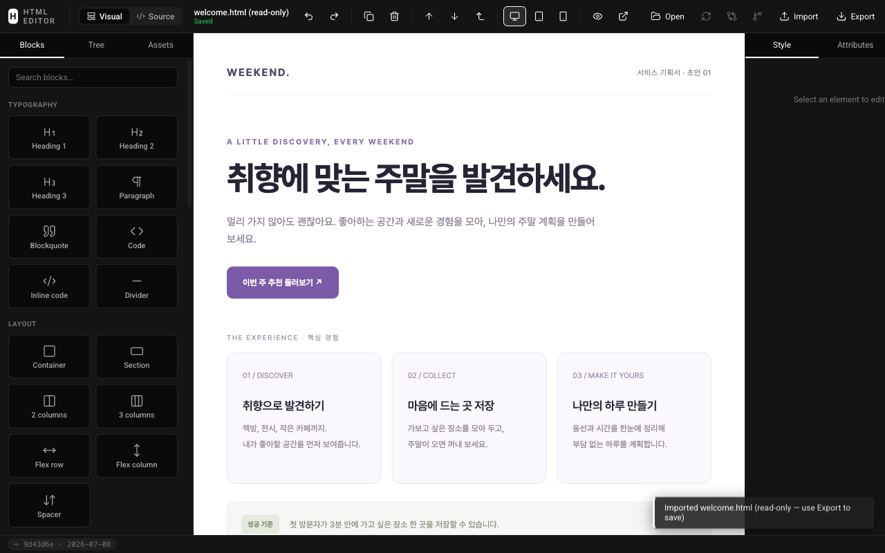
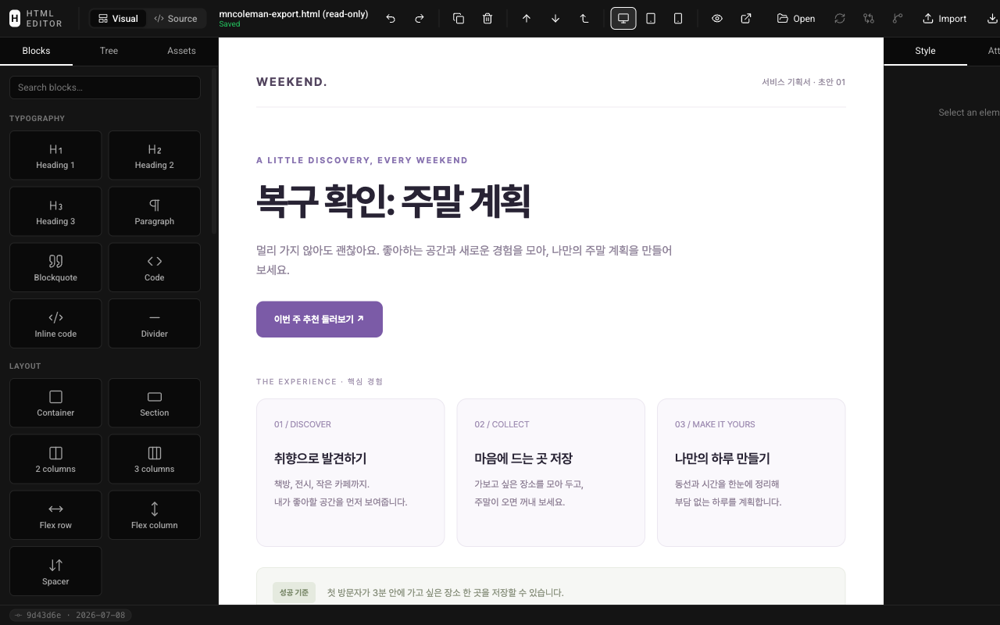
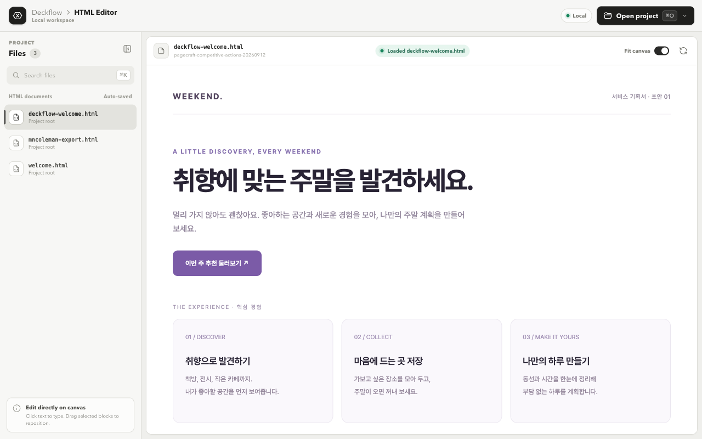
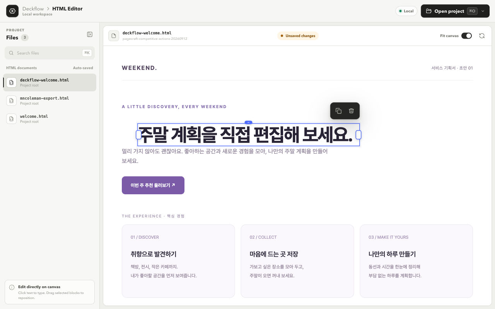

# Competitive usability validation

> Historical validation of the earlier Korean interface. The public version now defaults to English with a Korean language switch. These observations and screenshots are retained as dated evidence, not claims about the current release. The original Korean sample is now at `fixtures/ko/welcome.html`.
The observed evidence does **not** establish that Pagecraft is generally easier to use than competing HTML editors. Both closest competitors completed Korean text editing, duplication, undo, and persistence on the same planning document. Pagecraft has useful strengths for its intended job, but competitors also complete that job and offer capabilities worth adopting selectively.

This September 12, 2026 review extends the [competitive analysis](COMPETITIVE_ANALYSIS.md) with actual visible Chrome interactions. It focuses on editing an existing HTML document, rather than building a new website or reproducing all Figma/PPT features.

## Method and scope

The task list and fixture were fixed before testing. The [protocol](research/competitive-actions/protocol.json) records the task sequence and SHA-256 of `fixtures/welcome.html`, a self-contained Korean planning document. All three editors used identical initial bytes at a 1280 × 800 viewport in installed Google Chrome 153.0.8010.36 on macOS, with `headless: false` and an isolated browser context. Only synthetic copies were edited.

Playwright drove ordinary clicks, keyboard input, pointer gestures, file-chooser import, and downloads. DOM queries read text, styles, geometry, and draft state; they did not inject successful editor state. Screenshots were visually inspected. The [captured results](research/competitive-actions/results.json) distinguish completed tasks, unsuccessful attempts, and untested features.

One click, double-click, completed drag, text-entry operation, keyboard chord, file selection, or reload counts as one action. Setup and read-only inspection do not count. These are **observed paths**, not optimal action counts or measured human time. Different persistence modes make aggregate totals misleading: mncoleman imported/downloaded a copy, while Deckflow opened a copied local file through its CLI and automatically wrote to it.

| Product | Tested entry and pinned source |
|---|---|
| mncoleman HTML Editor | [Public application](https://html.mncoleman.com/); displayed version matched [commit `9d43d6e`](https://github.com/mncoleman/html-editor/tree/9d43d6e94af8aef6743e3fe44783f22ef2d661ee). The deployed asset bundle was not independently hash-matched. |
| Deckflow HTML Editor | Local CLI from [commit `cc1e9a7`](https://github.com/deckflow/html-editor/tree/cc1e9a7c61a1e02e50be2a9a4fe86237cafa7a8d), package 0.1.8; installed production dependencies and opened an isolated fixture copy. |
| Pagecraft | Current working build with draft recovery and move snapping; same fixture, Chrome version, and viewport. The earlier [headed Chrome validation](USER_JOURNEY_VALIDATION.md) remains separate baseline evidence. |

## Actions actually completed in competing editors

| Task | mncoleman | Deckflow |
|---|---|---|
| Open the fixture | Import button and file selection: **2 actions** | Preloaded by the CLI path; setup is separate from UI actions |
| Replace the heading with Korean text | Double-click, select all, type, click outside: **4** | Click, select all, type, Command+Enter: **4** |
| Move the heading | Free pointer drag was **inconclusive**; see limitation below | Move-handle drag: **1**; pointer delta 40/25px produced element delta 40/20px with snapping |
| Resize the heading | Width inspector entry and Tab: **2**; 680 → 580px | Width-handle drag: **1**; 680 → 575.328px |
| Duplicate | **1**; heading count 1 → 2 | **1**; heading count 1 → 2 |
| Undo duplication | **1**; heading count 2 → 1 | **1**; heading count 2 → 1 |
| Persist the edited HTML | Export: **1**; downloaded file contained the new text | Automatic disk write: **0 save clicks** |
| Reopen persisted output | Import and file selection: **2**; text preserved | Reload preview: **1**; text, movement, width, and single heading preserved |
| Recover an unexported edit | After the draft write, browser reload and Restore recovered the new text | Interrupted-save/draft recovery was not tested |

The mncoleman pointer probe stalled while awaiting a native drag operation; releasing the mouse ended it. This is not sufficient evidence of a product defect and is excluded from pass/fail scoring. Inspector width editing worked. “Drag not established” must not be shortened to “cannot resize or move.”

Additional actions showed meaningful differences:

- **mncoleman:** Move down reordered the heading after the introduction in one click. Its mobile preset changed the preview to 400px without changing the authored heading width. Shift-click selected only the second element, with one selection box; no element multiselect/alignment/distribution controls were discovered in this session.
- **Deckflow:** Selecting only `주말` and clicking Bold changed that text range, leaving the rest intact. The original weight was 650, so the toggle produced a 400-weight span for the selected range. No element multiselect/alignment/distribution control was found in the reviewed UI or advertised controls. This is a bounded discovery result, not proof that every integration lacks it.

The [pinned Deckflow README](https://github.com/deckflow/html-editor/blob/cc1e9a7c61a1e02e50be2a9a4fe86237cafa7a8d/README.md) documents automatic saving, snapping, range formatting, and regular-table row/column changes. The first three were exercised here; table editing was not. The [pinned mncoleman bootstrap](https://github.com/mncoleman/html-editor/blob/9d43d6e94af8aef6743e3fe44783f22ef2d661ee/js/editor.js) and [state implementation](https://github.com/mncoleman/html-editor/blob/9d43d6e94af8aef6743e3fe44783f22ef2d661ee/js/state.js) support the observed restore workflow.

## Usability findings and product decisions

| Finding | Evidence and implication |
|---|---|
| Neither competitor failed the basic correction workflow | A general superiority or faster-editing claim is unsupported. Source preservation is also shared with Deckflow, as its [pinned README](https://github.com/deckflow/html-editor/blob/cc1e9a7c61a1e02e50be2a9a4fe86237cafa7a8d/README.md) explains. |
| mncoleman has useful draft recovery | A local recovery copy reduces the cost of leaving the tab. Pagecraft should provide recovery while keeping original-file saving explicit. |
| Deckflow helps users place elements | Observed movement snapped to a nearby position. Bounded move snapping fits Pagecraft's existing canvas interaction. |
| mncoleman overflows the tested laptop viewport | Document width was 1450px at a 1280px viewport; Save began at x = 1333.8px. The initial screen required horizontal scrolling to reach rightmost controls. This is a specific layout weakness, not a judgment of all viewport sizes. |
| Accurate state display matters | mncoleman displayed an original computed weight of 650 as 300, and a restored unexported draft as Saved. Pagecraft's existing computed-value and copy-save distinctions address these particular ambiguities. |

Pagecraft **already has 1440px, 768px, 390px, and fit viewport previews**. Responsive presets are not a missing feature. Its previously verified Space-pan, focus selection, multiple selection, alignment, and explicit download state also remain part of the existing product; this review does not introduce them as new work.

The following additions preserve that product shape and avoid a new authoring model:

| Addition | Implemented scope and resource boundary |
|---|---|
| Browser draft recovery | IndexedDB recovery after 1 second of inactivity, with a 5-second maximum scheduling interval; at most five drafts and 20 MiB. Store original source once and subsequent edit deltas. Saving the original remains explicit. Restoration opens a separate `.recovered.html` copy without a writable file handle; it retains the original draft for other tabs. |
| Move snapping | Enabled by default; 6 screen CSS pixels of tolerance and Alt to bypass. Cache at most 200 stationary rectangles while visiting at most 800 candidates when a drag starts. Show at most two guides outside the HTML; refresh measurements on the next drag. This release does not add resize snapping. |

These limits describe the implementation contract. The current validation section below is the place to establish which cases were verified; implementation alone is not test evidence. Rich-text range formatting, table operations, and DOM reorder remain deferred because they require additional source-editing and interaction design. Adding every competing feature would make the existing-document workflow harder to maintain and explain.

## Pagecraft current comparison and regression results

The [Pagecraft action record](research/competitive-actions/pagecraft-results.json) comes from a separate visible Chrome session using the frozen fixture. Import, text editing, pointer movement, resize, duplicate/undo, multiple selection/right alignment, recovery, download/reopen, and Alt bypass completed without uncaught page errors.

| Task or observation | Pagecraft result | Comparison supported by this run |
|---|---|---|
| Import and Korean heading edit | 2 import actions; 4 edit actions | Same observed basic path length as mncoleman; not evidence of a faster editor |
| Duplicate and undo | 1 action each after selection; the recorded path also explicitly clicked to reselect the heading once | Both competitors also completed duplication and undo |
| Move and resize | 1 drag each; heading width 680 → 581px | Deckflow also supports one-gesture movement and resize. Canvas zoom differs, so resulting CSS displacement is not a speed or precision ranking |
| Select two elements and right-align | 2 selection clicks and 1 alignment click; both right edges became 923px; one undo restored the prior positions | Pagecraft completed a useful operation that was not achieved/discovered in either competing UI during this session |
| Recovery after reload | Reload plus 2 recovery clicks; Korean heading restored in `welcome.recovered.html`, download enabled, old undo unavailable | mncoleman needed reload plus 1 Restore click. Pagecraft's list supports choosing among drafts, at the cost of an extra click |
| Export and reopen recovered output | 1 download click, then 3 reopen actions including discard confirmation; heading and untouched comment preserved; no preview markers | mncoleman reopened with 2 import actions. Pagecraft's extra confirmation follows its conservative copy-download state; it is additional friction, not an advantage in action count |
| Laptop layout and value accuracy | 1280px document width, 1000px canvas; save button fully inside viewport; computed and displayed font weight both 650 | These specific observations compare favorably with mncoleman's overflow and weight display. Deckflow also avoided horizontal overflow |

The matched heading edit was `주말 계획을 직접 편집해 보세요.`. The [downloaded HTML](research/competitive-actions/pagecraft-export.html) was imported again and its heading verified. This export/reopen followed recovery, so it also verifies the restored-copy path; the earlier baseline report separately covers ordinary export/reopen.

Move snapping rendered two guides during a live pointer gesture. In a second controlled gesture at the same zoom, a 3/8 screen-pixel movement snapped to CSS translation `0px 16.094px`; holding Alt for the same movement produced `4.576px 12.203px` and no guides. Undo restored both. Snapping aligns references; it does not prevent elements from overlapping or reflow their siblings.

At 667 × 375, the new draft banner left a 167px-high canvas with no horizontal document overflow. The recovery dialog measured 600 × 282.6px and stayed within the viewport. This checks short-height desktop layout, not touch usability.

Validation completed locally:

| Check | Result |
|---|---|
| TypeScript, browser syntax, unit/API, compiled server | Passed; 29 unit/API tests |
| Folder suite in Chrome and Aside | 146 passed, including 18 snapping and 14 IndexedDB cases across the two browsers |
| Browser app across Chrome, Aside, Firefox, WebKit | 91 ordinary passes, 7 known Aside expected download failures, 14 unsupported native-picker skips, combining the full run with the targeted correction described below |
| Extension package in bundled Chromium | 2 passed, including offline editing and source download |
| Additional draft-store cross-engine checks | 7 Firefox and 7 WebKit cases passed, including quota rollback, source reuse, and metadata-only listing |

The core suites total **268 ordinary passing cases**, plus the separately reported 7 expected failures and 14 skips. The initial browser matrix produced four unexpected failures in an existing free-drag test because snapping is now enabled by default. That test now switches snapping off through the UI without weakening its position, panning, or undo assertions; its four-browser targeted rerun passed. Dedicated snapping tests exercise the default-on behavior, zoom tolerance, grouped movement, Alt bypass, Shift constraint, source saving, undo, and bounded candidate work. Aside expected failures are specifically at the Playwright Blob-download boundary and do not certify successful Aside downloads. Native-file tests use OPFS-backed test pickers; real OS dialogs remain outside these results.

The final static app is **295,607 raw bytes / 87,201 gzip bytes**, versus the preceding `e3b3430` build's **276,334 / 81,363**. This is **19,273 raw / 5,838 gzip bytes added** (about 7.2% gzip). The build script sums independently compressed assets; it is not measured network transfer. There are no new dependencies, frontend frameworks, background polling intervals, or per-element workers. The recovery store and snap target limits bound added work, but this follow-up did not rerun the full CPU/heap benchmark and does not claim zero runtime overhead.

## Evidence and limits

The captures below are unmodified browser viewport screenshots from the synthetic fixture. The complete 60 MiB Playwright trace remains a local diagnostic artifact at `/tmp/pagecraft-competitive-actions-trace.zip`; it is intentionally excluded from the repository. The small protocol, measurement JSON files, selected screenshots, and Pagecraft exported HTML are included for review. The JSON also lists temporary diagnostic files from the original run; only the linked subset is included in this repository.

This is one fixture, one desktop viewport, one operating system, and an automation-driven review with visual inspection. It does not measure representative user task completion, learning time, preference, accessibility across assistive technologies, or large-document performance. Native OS file pickers, actual mobile/touch devices, competitor table workflows, and interrupted-save recovery remain untested. No general market, speed, memory, or usability ranking follows from these observations.

The defensible conclusion is narrower: Pagecraft can serve the existing-HTML correction workflow, competing products can also serve it, and draft recovery plus bounded movement assistance address concrete gaps without replacing Pagecraft's current interaction model.
