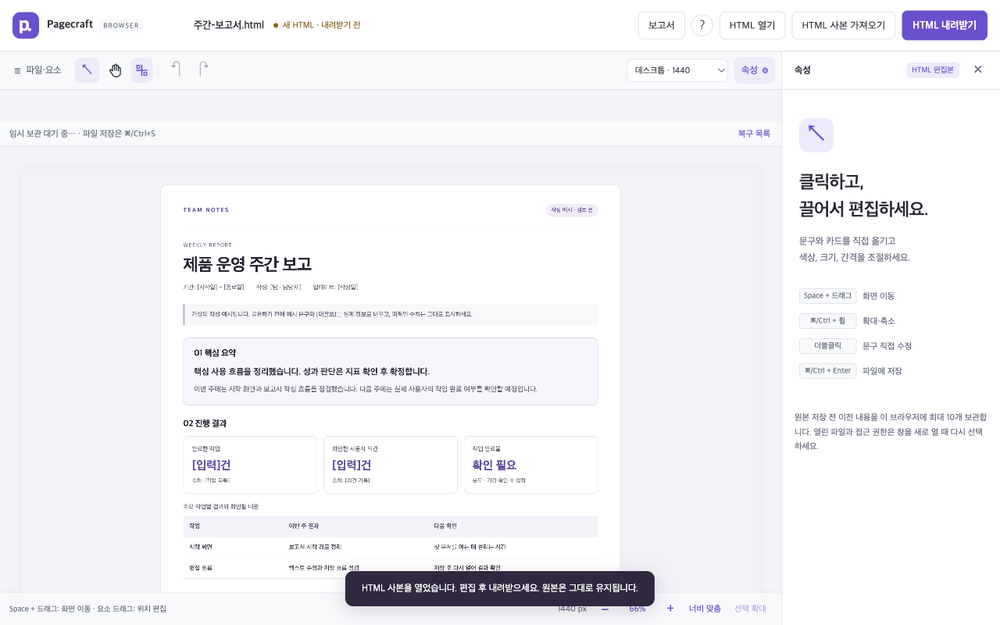
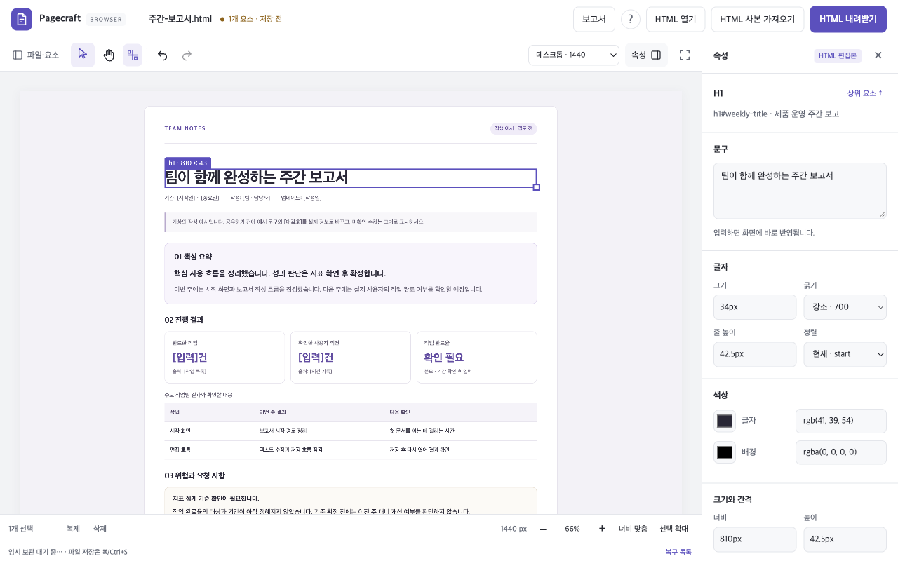
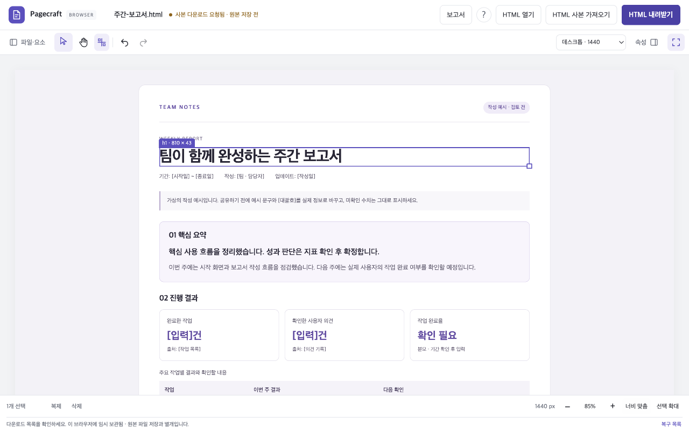
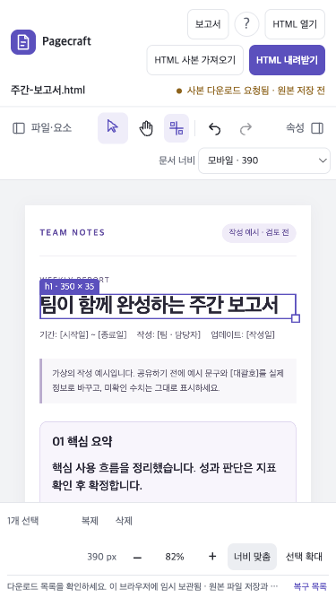

# Final UI and resource validation

> Historical validation of the earlier Korean interface. The public version now defaults to English with a Korean language switch. These observations and screenshots are retained as dated evidence, not claims about the current release. The original Korean sample is now at `fixtures/ko/welcome.html`.
Validated on September 13, 2026 (KST). The editor now reserves more space for the document, keeps notifications out of the canvas, and avoids measuring every selected element when the user moves or zooms the view. These are measured improvements to the existing lightweight implementation, not a claim that every HTML document or device will stay fast.

## Canvas and visual changes

| 1280 × 800 browser window | Before (`7f62ad6`) | After |
|---|---:|---:|
| Header height | 66px | 56px |
| Canvas, default laptop panels | 1000 × 570px | 1000 × 631px |
| Canvas with temporary focus mode | No combined toggle | 1280 × 631px |
| Temporary notifications | Floating over the document/controls | In the bottom status row |

The default canvas gains **61px of height, or 10.7% more area**. Focus mode folds both desktop panels without overwriting saved panel preferences or rescaling the document. Its second click restores the previous arrangement. Save, history, selection actions and zoom remain available. Narrow windows retain the existing drawers.

The selection-action row now shares the footer with zoom controls. On smaller canvases it wraps to a reserved row, so selecting or deselecting an element does not shift the first double-click or drag. Draft feedback stays below the controls. Long temporary messages truncate in narrow windows; their full text remains in the accessible status and desktop hover title. Touch-only users cannot expand that title. Persistent operation errors still have a separate visible retry area.

The shell uses neutral surfaces, one restrained indigo accent (`#5b50bd`), consistent stroke icons, smaller empty-state typography, and a plain canvas background. The installed-app icon and theme match the shell. There are no added fonts, images, animation loops, or UI dependencies in the shipped app. Evidence screenshots belong to the documentation only.

The use of compact controls and reversible panel minimization follows a common editor pattern. Figma documents the tradeoff between more canvas space and retaining access to tools; Pagecraft keeps its controls outside the document instead of adopting a floating tool palette. [Figma's UI3 design account](https://www.figma.com/blog/our-approach-to-designing-ui3/)









## Actual Chrome workflow

An isolated, visible installed Chrome session (153.0.8010.36, macOS) opened the weekly report, edited its title directly, folded the panels, fitted the document width, and downloaded the HTML. The downloaded file differed from the template only at the requested title: `팀이 함께 완성하는 주간 보고서`. No editing UI or view changes entered the saved source, and no uncaught page error occurred.

At 375 × 667px, the document had no horizontal page overflow; the canvas was 375 × 359px and the save control stayed visible. Selecting a 390px document preview made the report's responsive layout usable in that window. This is browser viewport testing, not a physical touch-device study.

## Camera work and repeated use

A synthetic 2,001-node report exposed avoidable work: with 100 elements selected, 60 pan frames remeasured all 100 elements on every frame. The selection outlines already belong to the same transformed artboard as the document, so those reads are unnecessary. Removing the camera-only callback leaves real document, layout and selection updates intact.

| Camera action | Before | After |
|---|---:|---:|
| Selected-element rectangle reads, 60 pan frames | 6,000 | 0 |
| Selected-element rectangle reads, 10 zoom clicks | 1,000 | 0 |
| Main-thread task time during pan, synthetic 4× CPU slowdown | 190.8ms | 49.8ms |
| Layout time during the pan interval | 9.6ms | 0ms |

The rectangle counts are deterministic and covered by `e2e/performance.spec.ts`, which also verifies outline alignment after pan/zoom and refreshing after an actual width edit. Timing is an observational comparison: other shell edits and host activity occurred between the runs. It does not establish a universal speedup or frame rate. [Before metrics](research/final-polish/camera-baseline.json), [after metrics](research/final-polish/camera-after.json)

The final browser build also completed 30 import → text edit → undo cycles using a 2,001-node document. At cycles 10/20/30 it retained 10 files, 1 worker, 1 iframe, 196 event listeners and 2 document objects. Page-target JavaScript heap after forced collection was **3.90 / 3.92 / 3.96 MiB**, with zero detached script states. In a final three-second idle interval, script time and additional requests were zero; main-thread task time was approximately 2.43ms. No uncaught page errors occurred. [Raw retention metrics](research/final-polish/retention.json)

This supports bounded retention for this workload. The measurement excludes worker heap, native/GPU memory and total browser RSS. Thirty synthetic cycles on an Apple M4 Pro do not substitute for hours of work on low-end devices or complex real-world HTML.

Reproduce the bounded-retention probe after building the current source:

```sh
npm run build:web
node --import tsx docs/research/retention-probe.mjs
```

It uses an isolated browser context and temporary server, and writes `docs/research/final-polish/retention.json`. It does not use the user's Chrome profile or documents.

## Build and regression results

The final static app is **327,496 raw / 97,702 gzip bytes**, compared with **325,482 / 97,318** at `7f62ad6`: **2,014 raw / 384 gzip bytes added**. These totals sum independently compressed assets; they are not measured network transfer or process memory. The editing worker is still created only after opening HTML. No dependency was added.

| Local suite | Result |
|---|---|
| TypeScript, browser syntax, unit/API, compiled server | Passed; 43 unit/API cases |
| Folder editor in installed Chrome and Aside | 154 passed |
| Browser app in Chrome, Aside, Firefox and WebKit | 113 ordinary passes, 9 existing expected Aside download failures, 14 unsupported native-picker skips |
| Bundled Chromium extension | 3 passed, including offline editing and report export |

There are **313 ordinary passing cases**; expected failures and skips are separate. Focus-mode restoration, non-overlapping status messages and camera geometry are new regressions. Existing coverage includes initial double-click/drag stability, keyboard saving and composition, multiple selection, all six alignments, recovery, offline reports and human/agent handoff. The final icon/theme update was included in the extension build and tests.

These results do not remove Aside's existing download/shortcut limitations or verify native Safari/iOS. Repository visibility, distribution and supported document types remain unchanged.
