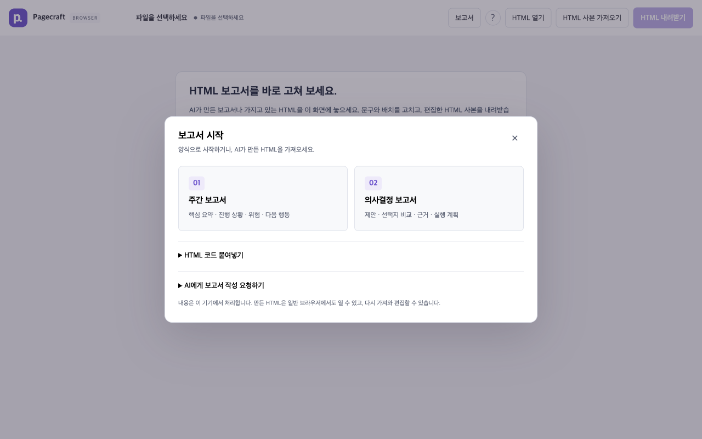
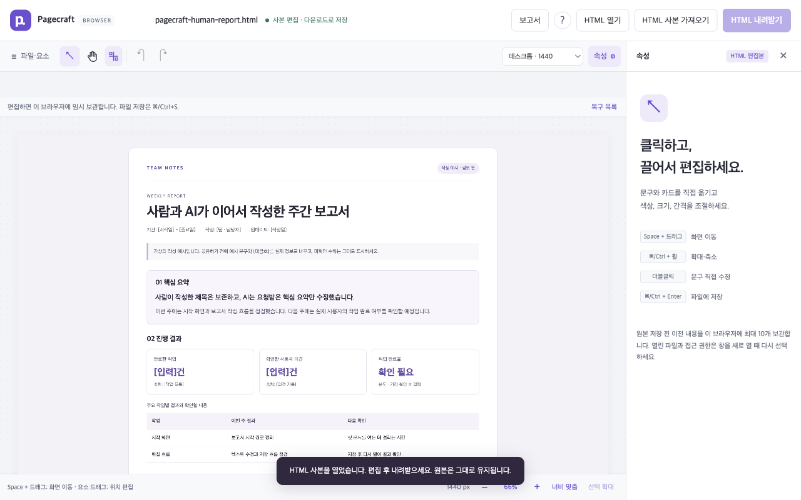
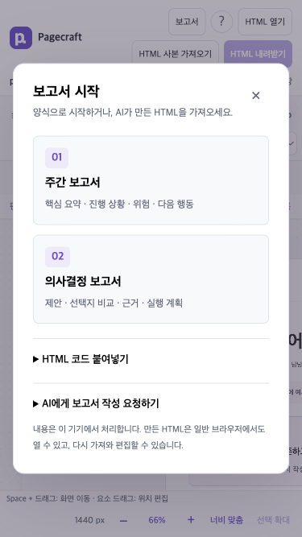

# Report and agent workflow validation

> Historical validation of the earlier Korean interface. The public version now defaults to English with a Korean language switch. These observations and screenshots are retained as dated evidence, not claims about the current release. The original Korean sample is now at `fixtures/ko/welcome.html`.
Validated locally on September 12, 2026. Pagecraft now provides report starters and pasted-HTML entry for people, plus a provider-independent inspect/apply CLI for coding agents. This focuses the product on editing and handing off ordinary report files. It does not establish adoption, superiority over competitors, or quality of AI-generated content.

## The shared-document contract

| Person | Coding agent | Shared result |
|---|---|---|
| Selects a weekly report or decision brief and edits text on the canvas | Inspects the saved file and finds a meaningful authored ID | Ordinary UTF-8 HTML, without conversion into an editor-specific project format |
| Saves or downloads the latest work | Validates a hash-bound patch and applies only requested text/styles | Unrelated source, stable IDs, comments, and CSS are preserved |
| Reloads the updated file and continues editing | Reinspects before the next change | Sequential handoff; stale writes are rejected, not silently merged |

The report templates are useful starting documents rather than a requirement. Existing HTML remains supported; agents can use inspected source-offset IDs where authored IDs are absent. See the [agent guide](AI_EDITING.md) for limits and exact commands.

## Visible Chrome journey

An isolated installed Chrome session (153.0.8010.36, macOS, `headless: false`) completed these actions using ordinary clicks, keyboard input, file selection, and downloads:

1. Open the report chooser at 1280 × 800. The dialog was 680 × 375.6px, document width stayed 1280px, and no editing worker existed before choosing a template.
2. Choose the weekly report, replace `weekly-title` with Korean text, and download the HTML. The title became `사람과 AI가 이어서 작성한 주간 보고서`.
3. Inspect that downloaded file through the CLI using `--query weekly-summary-lead`. The response returned 1 matching node out of 62 and the current source hash.
4. Dry-run and apply a patch to that stable ID. Import the resulting file back into the visible editor. The changed title was preserved and only the requested summary text changed; there were no uncaught page errors.
5. Open the chooser at 375 × 667. The 343 × 510.1px dialog and save button stayed within the viewport, with no horizontal document overflow.

The patch changed source hash `ddd2f03865da9b9a6942b64c67fd2f5083c98751c7f606295ed0efff16a01f25` to `788535bca360733564a9941d6d862d38b494817fa2ae6aa6a1c8a9cd5a252a8c`. Dry run reported `written: false`; in-place apply reported a backup and `written: true`. These are synthetic fixtures, not user documents or a representative user study.

## Automated coverage

| Suite | Completed result |
|---|---|
| TypeScript, browser syntax, unit/API, compiled server | Passed; 43 unit/API cases including 14 new CLI cases |
| Folder editor in Chrome and Aside | 148 passed, including the two human/agent handoff executions |
| Browser app across Chrome, Aside, Firefox and WebKit | 113 ordinary passes, 9 known Aside expected download failures, 14 unsupported native-picker skips, combining the full matrix and the final report-case rerun |
| Extension in bundled Chromium | 3 passed, including a fresh report downloaded without an intervening edit and with network offline |
| Keyboard/workspace follow-up after modal isolation fix | 38 passed; these are reruns of cases counted above |

The core suites contain **307 ordinary passing cases**. Expected failures and skips are separate. The full browser run initially found two new WebKit failures. Native undo could span inputs outside the report dialog; a `beforeinput` guard now prevents a modal undo from changing a previously edited inspector field. Its regression retains the existing document while allowing native undo inside the dialog. WebKit's emulated offline mode also rejected a template fetch; the final test stops the actual static server and verifies an uncached request fails before opening the cached report. All 24 report cases completed in the final four-browser run; two are Aside's expected download failures.

CLI tests cover pagination/text bounds, exact hashes, source preservation, UTF-8 and size limits, dry runs without file changes, stale/missing/ambiguous targets, invalid styles/operations, no-overwrite output, in-place backups, retained permissions, and machine-readable errors. The handoff regression uses actual browser saves and separate CLI processes to verify stale requests in both directions, explicit reload, final persistence, and three exact-content backups.

## Template and resource checks

| Template | Source | Editable text leaves | Editable table cells | Chrome layout and print |
|---|---:|---:|---:|---|
| Weekly report | 9,123 bytes | 41 | 9 | No horizontal overflow at 390/1280px; 2 A4 pages |
| Decision brief | 9,404 bytes | 42 | 12 | No horizontal overflow at 390/1280px; 2 A4 pages |

The [template measurement record](research/report-workflow/templates.json) records zero external requests and no scripts/styles/assets requiring a network. The templates include print styles, but Pagecraft has no custom PDF export button. Printed pagination can change when users replace the example content.

The static build is **325,482 raw / 97,318 gzip bytes**, versus the preceding `5a7ce27` build's **295,607 / 87,201**: **29,875 raw / 10,117 gzip bytes added** (about 11.6% gzip). This includes both report templates in the offline assets. Build sizes sum independently compressed files; they are not measured network-transfer or runtime-memory results.

The CLI, patch schema and agent documentation are excluded from browser bundles. The CLI needs no browser or server and adds no dependency. Browser template parsing begins only after selection; the trusted templates themselves are precached for offline availability. Pasted HTML is size-checked and imported through the existing worker and preview policy, never inserted into the parent editor DOM. No AI provider is contacted and no polling loop was added.

## Remaining limits and adoption work

The portable CLI is usable by tools that run local commands; this session did not separately launch Claude Code or an additional Codex instance. It verifies the interface and editing contract, not model behavior. There is no live merge, agent access to unsaved browser drafts, or file lock against simultaneous writes.

Static hosting and extension-store distribution remain unshipped. The repository is private, and end-user installation still requires a supplied package or access to the local/hosted app. Publishing, collaboration, language localization, and a participant-based usability study remain separate decisions. These additions improve a concrete report workflow without claiming that many users already prefer it.

The design is consistent with browser clipboard constraints: automatic text copying can be denied, so a selectable manual-copy path remains available. [MDN Clipboard.writeText](https://developer.mozilla.org/en-US/docs/Web/API/Clipboard/writeText)
