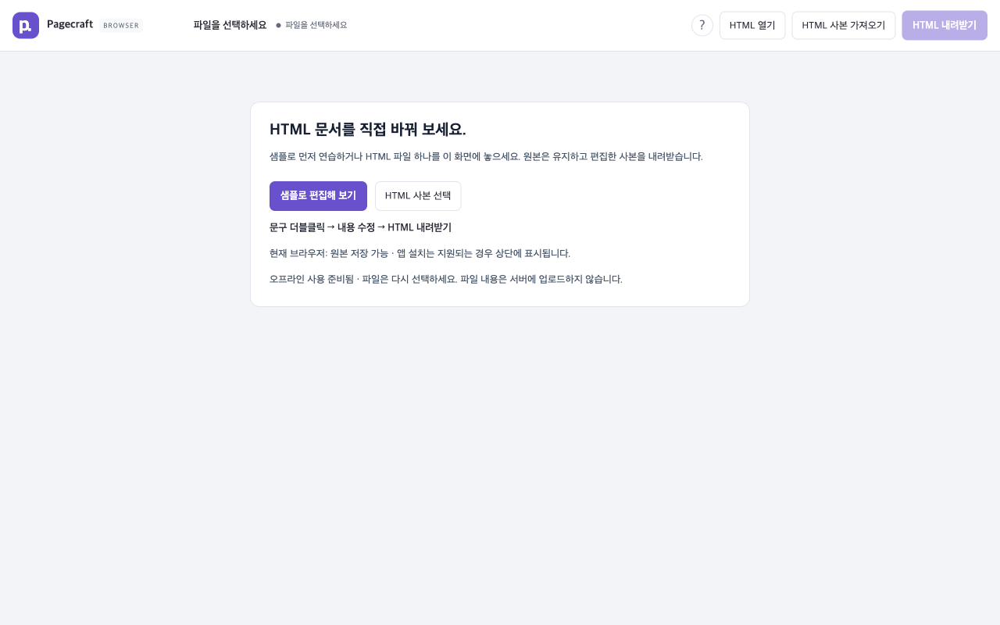
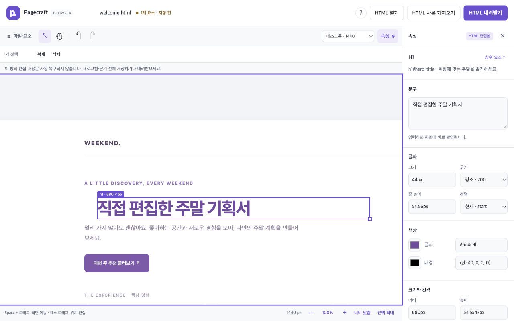
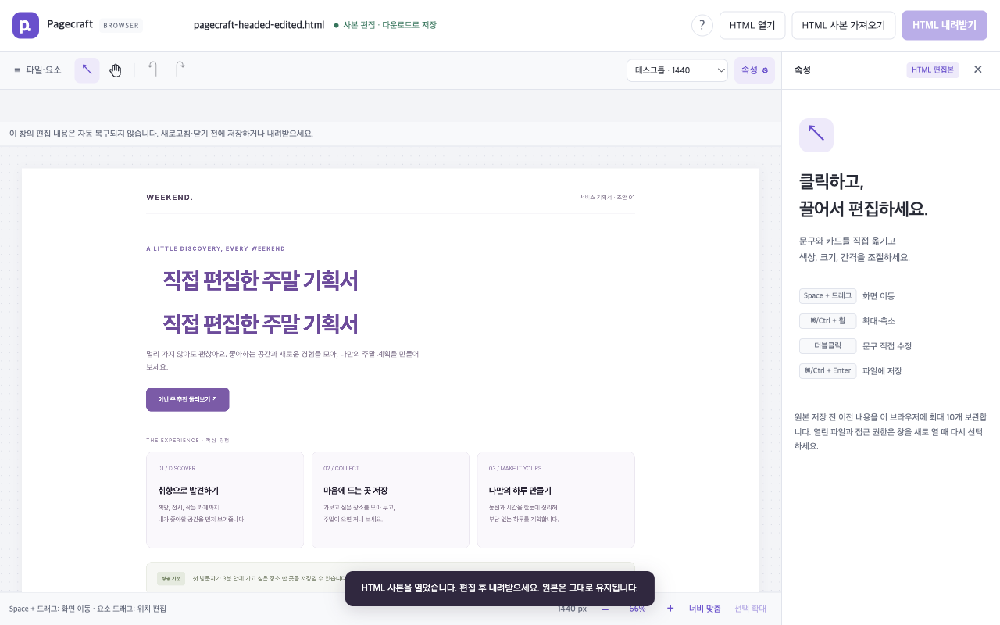
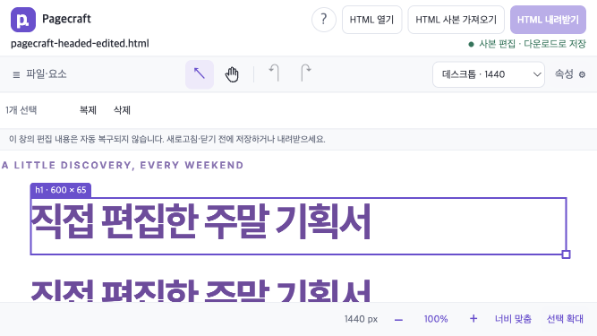

# Headed Chrome editing validation

> Historical validation of the earlier Korean interface. The public version now defaults to English with a Korean language switch. These observations and screenshots are retained as dated evidence, not claims about the current release. The original Korean sample is now at `fixtures/ko/welcome.html`.
Observed on September 12, 2026, after the [baseline performance and UX audit](PERFORMANCE_UX_AUDIT.md). The editor was opened in an actual visible Google Chrome 153.0.8010.36 window on macOS, using an isolated browser context. The existing user's browser profile and project documents were not changed.

The basic static-HTML editing journey passed: import, direct text editing, properties, movement, pan, zoom, resize, duplicate, delete, undo, multiple selection, alignment, download, and reopening the downloaded HTML. This is an automation-driven interaction review with screenshot inspection, not a study with independent human participants or proof of Figma/PPT feature parity.

## What was exercised in the visible browser

Playwright drove real file-chooser, mouse, keyboard, and download actions. Read-only DOM queries checked rendered geometry and styles. The walkthrough did not inject editor state or change DOM content to simulate successful edits. The sample was `fixtures/welcome.html`, a self-contained Korean planning document.

| User action | Observed result |
|---|---|
| Open the editor at 1280 × 800 | A focused welcome screen; no inactive editor panels or selection tools |
| Focus Help and press Space | Help opened; Escape returned to editing |
| Import HTML through the copy chooser | The planning document rendered; its original file remained unchanged |
| Double-click the heading and type Korean | The heading became `직접 편집한 주말 기획서`; selecting another control committed the edit |
| Inspect an existing custom weight | The original weight appeared as `현재 · 650`, instead of `기본값` |
| Focus the selected element | The heading reached 100% zoom and was centered without an HTML edit |
| Change size, weight, and color | 44px, 700, and `#6d4c9b` rendered in the document |
| Drag at 100% | The element acquired `translate: 32px 12px` |
| Hold Space and drag over the heading | The view moved; the element's style remained unchanged |
| Resize using the handle | The heading became 600 × 65px |
| Duplicate, delete, and undo | The heading count changed 1 → 2 → 1 → 2 |
| Shift-select both headings and align left | Both document-space left edges were 275px |
| Press Command+S | Chrome downloaded `welcome.html`; no browser Save Page dialog opened |
| Wait for the toast to disappear | `사본 다운로드 요청됨 · 원본 저장 전` remained visible |
| Import the downloaded HTML | Both edited headings, styles, dimensions, and movement persisted; the reopened document had no pending changes |
| Resize Chrome to 667 × 375 | The canvas measured 667 × 168px, the handle target remained 24 × 24px, and the page did not overflow horizontally |

No JavaScript page errors were recorded during the final walkthrough. [Captured values](research/headed-journey-results.json) retain the concrete styles and round-trip observations.

## Changes made from observed problems

| Problem | Implemented change | Verification |
|---|---|---|
| Too many inactive controls on the empty screen | Hide unused welcome-screen chrome | Visible Chrome screenshot |
| Limited laptop editing area | Fresh laptop sessions collapse the file panel; saved preferences still win | Canvas width 752 → 1000px at 1280 × 800; preference persistence regression |
| Text is too small in the overview | Add **Focus selection** (선택 확대), bounded to 25–100% | Heading reaches 100%; oversized elements fit when possible; HTML and history remain unchanged |
| Space is consumed on editor buttons | Preserve native keyboard activation outside the canvas | Help, sample, toolbar, summary, and dialog regressions; iframe Space-pan retained |
| Custom or mixed styles appear as defaults | Show computed current values and a distinct mixed state | Weight 650, mixed 650/400, batch style changes, undo, and reset regressions |
| The download toast disappears without a lasting result | Persist request status and distinguish subsequent edits | Status after toast dismissal; undo retained; canceled gestures restore the prior status |
| Small resize target | Use a 24px target with a 10px visible handle | Rendered bounding-box checks |
| Short windows leave little usable canvas | Compact toolbar/footer rows and remove redundant short-window hints | Browser canvas height 79.5 → 168px at 667 × 375 |
| Showing contextual controls shifts the canvas | Reserve a stable selection row and scroll actions horizontally on narrow screens | Actual first double-click and first drag at 667px and 390px widths |

The contextual-toolbar layout shift was found by the full regression run during implementation. It broke first double-clicks and added the toolbar's height to the first drag displacement. The final layout keeps the canvas top unchanged through zero, one, or multiple selections; all affected tests then passed.

## Resource changes

No new runtime dependency, framework, icon package, or WASM module was added.

- Camera pointer and wheel events now share one animation-frame render. A burst of 20 wheel events produces one artboard transform mutation while retaining accumulated movement. Pending iframe zoom uses the last rendered scale for pointer coordinates.
- A blank click or subthreshold drag no longer measures the whole document. The 2,001-node regression observes **zero editable-element rectangle reads** before the drag threshold. A real marquee measures candidates once and still selects the expected rows.
- Original text snapshots are kept only for directly editable text elements. Container `textContent` is no longer repeatedly copied during initial attachment or duplication.
- Download status uses a revision counter and shallow patch comparisons, rather than serializing the whole document or edit map during interaction.

The browser build is **276,334 raw bytes / 81,363 calculated gzip bytes**, compared with the baseline's 271,226 / 80,212. The gzip increase is approximately 1.4%. Gzip values describe compressed artifacts; the local static server does not automatically send gzip. Startup, long-task, and memory timings from the baseline were not remeasured, so this report does not claim new timing or memory results.

## Final regression results

| Suite | Ordinary passes | Expected failures | Skips |
|---|---:|---:|---:|
| Unit/API, with type and browser syntax checks | 29 | 0 | 0 |
| Folder editor, installed Chrome | 57 | 0 | 0 |
| Folder editor, installed Aside | 57 | 0 | 0 |
| Browser editor, Chrome | 20 | 0 | 0 |
| Browser editor, Aside | 14 | 6 | 0 |
| Browser editor, Firefox | 15 | 0 | 5 |
| Browser editor, WebKit | 15 | 0 | 5 |
| Extension package, bundled Chromium | 2 | 0 | 0 |
| **Total** | **209** | **6** | **10** |

There were **zero unexpected failures** in the final runs. The server build and web/extension builds also passed. Playwright includes expected failures in its aggregate passing count, so the browser runner reports `70 passed, 10 skipped`; the table separates the six known Aside download failures.

```sh
npm run check
npm run build
PAGECRAFT_ASIDE_PATH=/Applications/Aside.app/Contents/MacOS/Aside npm run test:e2e
PAGECRAFT_ASIDE_PATH=/Applications/Aside.app/Contents/MacOS/Aside npm run test:browser
npm run test:extension
```

For a visible repeat of the interaction regressions, use `npx playwright test e2e/workspace.spec.ts e2e/canvas.spec.ts --project=chrome --headed`. The browser import/download journey is covered by `e2e/browser-mode.spec.ts`; run `npm run build:web` before launching that configuration with `--headed`.

## Screenshots from the visible Chrome walkthrough

The screenshots are unmodified browser viewport captures of the bundled planning fixture.









## Remaining limits

This validates the core static-HTML workflow on one macOS machine. Window resizing does not validate touch interaction or a physical mobile device. The interface is still Korean-only.

The browser's OS-native file picker and permission dialogs were not driven in this walkthrough. Separate tests use genuine OPFS file handles to verify native-write behavior, conflicts, and backups. Aside's Blob download cancellation remains an explicit expected failure; its end-user download UI still needs manual confirmation.

There is no autosave or crash recovery. Download requests do not certify completed downloads or overwrite the original. Undo/redo conservatively marks a later revision even when content becomes equivalent to a previous export. Documents that require scripts or external resources still have the compatibility limits described in [Usage](USAGE.md).
